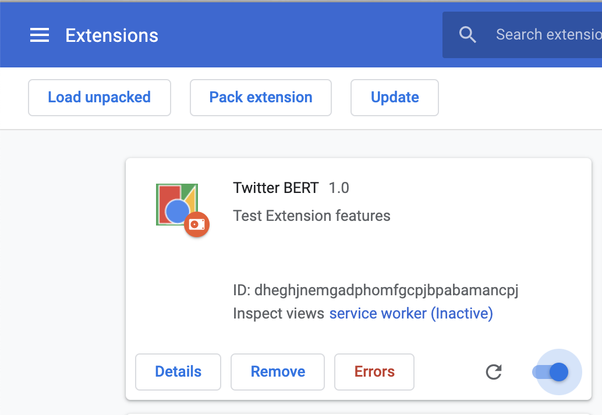

# BERT Transformer Architecture for NLP

This repository contains code for the [O'Reilly Live Online Training for Hands on Transfer Learning with BERT](https://learning.oreilly.com/live-events/hands-on-transfer-learning-for-nlp-with-bert/0636920061282/0636920061281)

This training will focus on implementing BERT to solve a variety of modern NLP tasks including information retrieval, sequence classification / regression, and question/answering tasks. The training will begin with a refresher on the BERT architecture and how BERT learns to model language. We will then move into examples of fine-tuning BERT on domain-specific corpora and using pre-trained models to perform NLP tasks out of the box.

BERT is one of the most relevant NLP architectures today and it is closely related to other important NLP deep learning models like GPT-3. Both of these models are derived from the newly invented transformer architecture and represent an inflection point in how machines process language and context.

The Natural Language Processing with Next-Generation Transformer Architectures series of online trainings provides a comprehensive overview of state-of-the-art natural language processing (NLP) models including GPT and BERT which are derived from the modern attention-driven transformer architecture and the applications these models are used to solve today. All of the trainings in the series blend theory and application through the combination of visual mathematical explanations, straightforward applicable Python examples within hands-on Jupyter notebook demos, and comprehensive case studies featuring modern problems solvable by NLP models. This training is part of a series and assumes that the attendee is coming in with knowledge from BERT Transformer Architecture for NLP training. (Note that at any given time, only a subset of these classes will be scheduled and open for registration.)

### Notebooks

[Classification with BERT](notebooks/classification.ipynb)

[Spelling / Grammar with BERT](notebooks/grammar_spell_check.ipynb)

[Question/Answering with BERT](notebooks/question_answering.ipynb)

[Information Retrieval with BERT](notebooks/information_retrieval.ipynb)

[3rd Part BERT Models](notebooks/third_party_models.ipynb)

### Twitter Chrome Extension

To run this requires some additional work

#### Installation

1. Make sure you have flask installed (it is in the requirements.txt)
2. [Install ngrok](https://dashboard.ngrok.com/get-started/setup) to generate a secure tunnel to your local app

#### Running the App
1. From the root directory, run `python3 twitter-bert-flask-app/app.py` to start your local flask app
2. Test the app by  going to [http://localhost:5050/classify?tweet=this earthquake is causing such devastation](http://localhost:5050/classify?tweet=this earthquake is causing such devastation)
3. Run ngrok to create a secure tunnel `ngrok http 5050`. This will make a random tunnel each time unless you pay for subdomains (I recommend it if you use ngrok frequently)
4. In `twitter.js`, change `twitter-bert.ngrok.io` to whatever subdomain your ngrok has chosen on startup
5. In chrome, navigate to `chrome://extensions` and click on `Load unpacked`. To do this, you must have `Developer Mode` on ont he top right of this page.

6. Navigate to twitter and see it work!

- Red borders indicate a probability of >= 90% of the tweet being about a disaster
- Yellow borders indicate a probability of >= 50% of the tweet being about a disaster
- Green borders indicate a probability of < 50% of the tweet being about a disaster

## Instructor

*Sinan Ozdemir* is currently the Director of Data Science at Directly, managing the AI and machine learning models that power the company’s intelligent customer support platform. Sinan is a former lecturer of Data Science at Johns Hopkins University and the author of multiple textbooks on data science and machine learning. Additionally, he is the founder of the recently acquired Kylie.ai, an enterprise-grade conversational AI platform with RPA capabilities. He holds a Master’s Degree in Pure Mathematics from Johns Hopkins University and is based in San Francisco, CA.